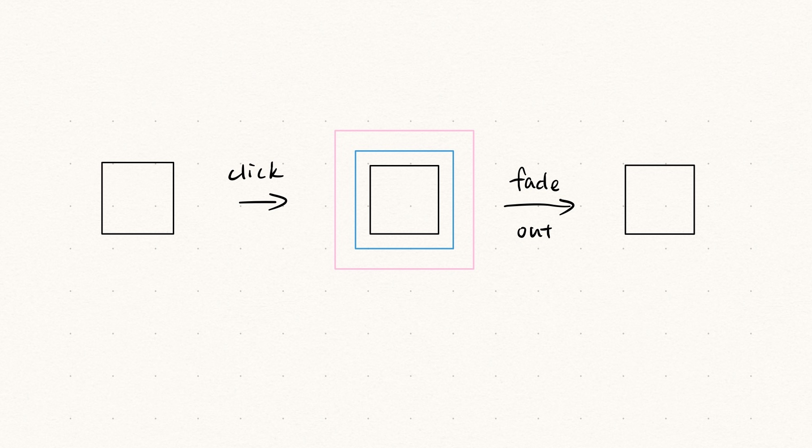
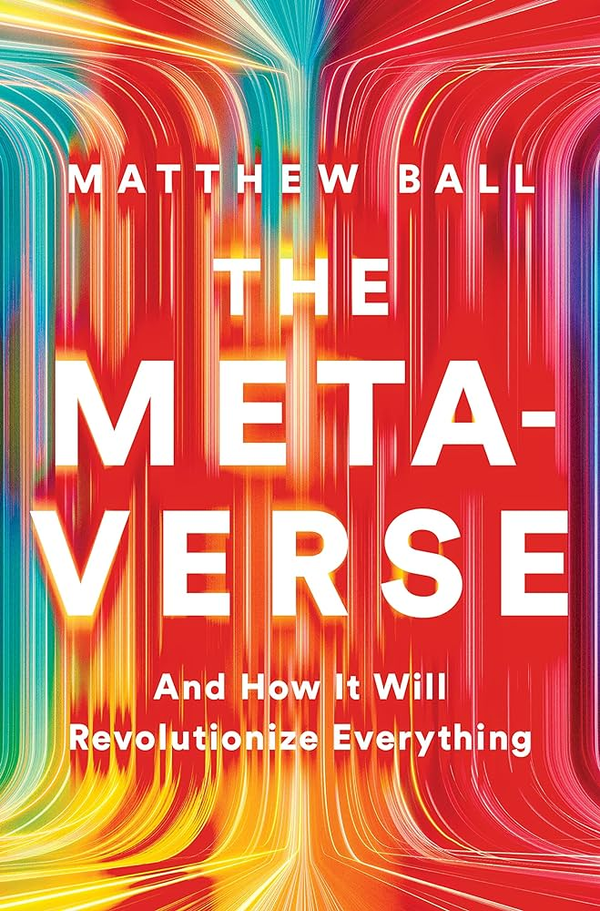
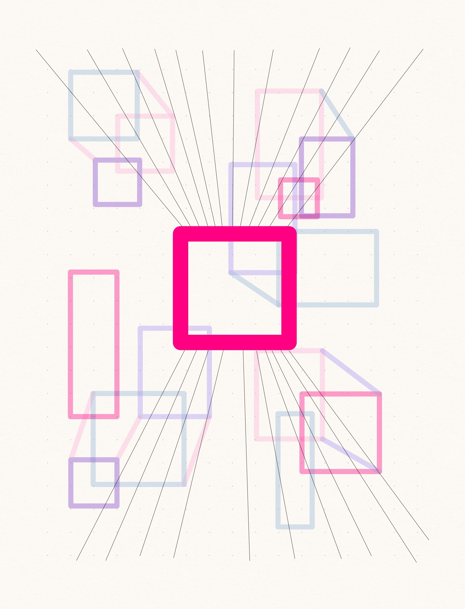
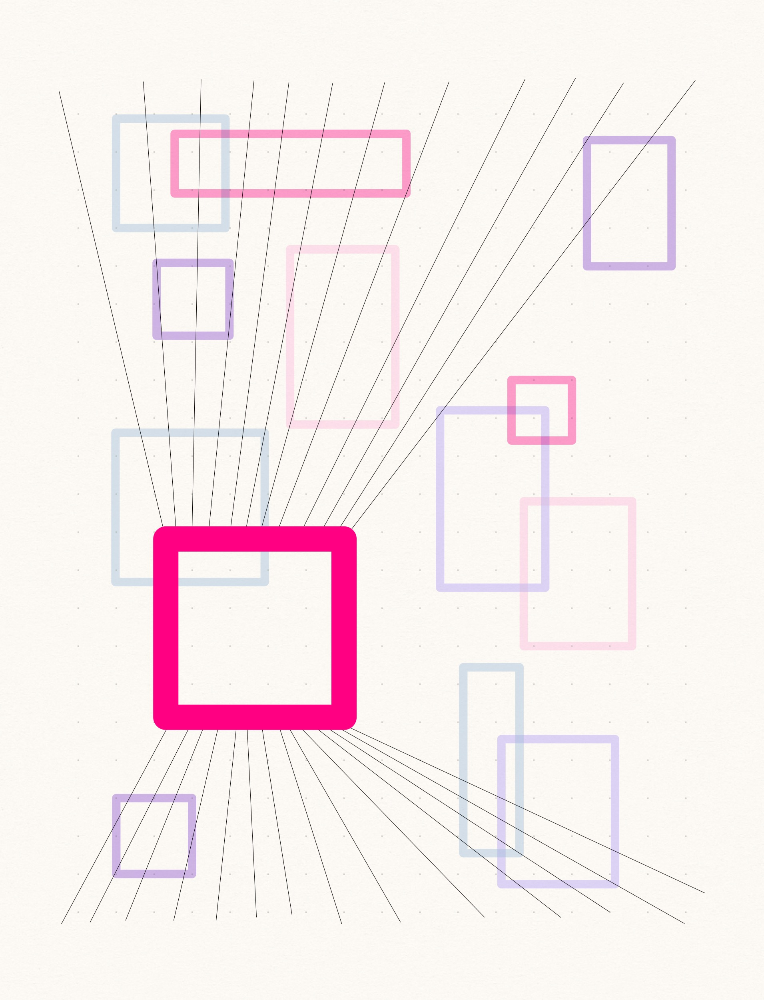

## The Metaverse: And How It Will Revolutionize Everything, Matthew Ball  
### Milestone2

**1. What I’ve done this week**
I’ve created the squares fade in/out effect, the basic line structures and a square moving with the mouse position.

**2. Arrays**
Squares Array: This array is used to store information about the squares displayed on the canvas.  Each square is represented as an object within the array.  The objects contain properties like x and y coordinates, r for size, and color for the square's color.

Colors Array: This array contains a palette of colors used for filling the squares. The colorIndex variable is used to cycle through the colors in this array.

**3. Interactivity or time-based logic**
Mouse Interaction: It enables the user to draw a white square that follows the mouse position.  This creates an interactive element as the square moves with the mouse.

Square Animation: The project includes a dynamic animation of squares that fade in and out.  New squares are continually added to the canvas with randomized sizes and colors. The animation logic is time-based, gradually reducing the size of the squares until they disappear.

**4. Description of functions I will write**
Lines Animation: The code generates a set of lines that create an animated effect. The lines move from left to right, and one side of the lines is influenced by the mouse's horizontal position.

Mouse Click Function: Based on the current white square, I’d like to create the effect that when clicking there are squares bigger and then fade out. 

Text Animation: The text of book name comes into the canvas.

### Milestone 1

**1. What book did you choose? What is it about?**  

I have chosen the book "The Metaverse: And How It Will Revolutionize Everything" by Matthew Ball. This book delves into the concept of the metaverse, exploring how virtual worlds, augmented reality, and interconnected digital spaces are poised to transform our lives, economies, and societies. It examines the potential impact of the metaverse on various aspects of human existence, from entertainment and work to education and social interactions.  

**2. What aspect of the book will you include in your cover?**  

For the interactive book cover, I want to encapsulate the essence of the metaverse and the transformative journey it offers to readers. I will create a visually engaging and immersive digital artwork that symbolizes the convergence of real and virtual worlds. The cover will be a gateway to the metaverse, inviting readers to explore its limitless possibilities.  

**3. Is it interactive?  time-based?  both?**  

This design incorporates both interactive and time-based elements to engage the viewer in a dynamic visual experience.

Enhancing Interactivity with Mouse Events: In this design, one end of the line remains stationary, while the other end dynamically follows the mouse position, adding an interactive element to the composition.

Introducing Time-Based Effects: Simultaneously, the square shapes undergo a gradual fade-in and fade-out animation, creating a time-based visual enhancement.  

**4. What ideas would you like to explore or experiment with?**  

Symbolism and Visual Metaphors: In the visual design of the cover, I intend to experiment with the use of symbolism and visual metaphors to convey complex ideas from the book. The challenge lies in effectively translating these abstract ideas, such as the metaverse, virtual reality, interconnected networks, and digital transformation, into visually compelling elements that resonate with readers.  

**5. Are there aspects of your project that are related to any of the readings we’ve done?**  

Yes, there are indeed aspects of my project that resonate with the themes explored in “Program or Be Programmed” by Douglas Rushkoff. In “Program or Be Programmed”, Rushkoff posits that individuals should strive to be active, knowledgeable participants in the digital realm rather than passive consumers. Similarly, my project aims to encourage an engaged and informed interaction with technology. The metaverse, as explored in my interactive book cover design, represents a transformative digital frontier, akin to the digital landscape Rushkoff discusses.  

Through the visual design of the interactive book cover, I intend to foster curiosity and engagement, much like Rushkoff's call for individuals to actively shape their digital experiences. By offering an immersive and dynamic experience, my project encourages readers to contemplate the evolving nature of the metaverse and its potential consequences for our lives.  

**Moodboard:**  

**Sketch:**  

The deeppink square and one end of the lines are both interactive and responsive to the mouse's movement.  

Deeppink Square: The deeppink square serves as a symbolic representation of the media's role as a gateway to the metaverse. It signifies the accessibility and immersion offered to users, akin to the experience of using VR equipment or other digital interfaces.  

Lines: The lines within the sketch symbolize the interconnected relationship between the digital metaverse and real-life experiences.  They serve as a visual representation of how these two realms intersect and influence each other.  

Light Colorful Squares: These squares, in light and vibrant colors, symbolize the elements in the metaverse and the concept of digital transformation. Their dynamic movement and gradual fading in and out depict the ever-evolving nature of the digital landscape. This visual element represents the continuous adaptation and change inherent in the digital world.  

  

